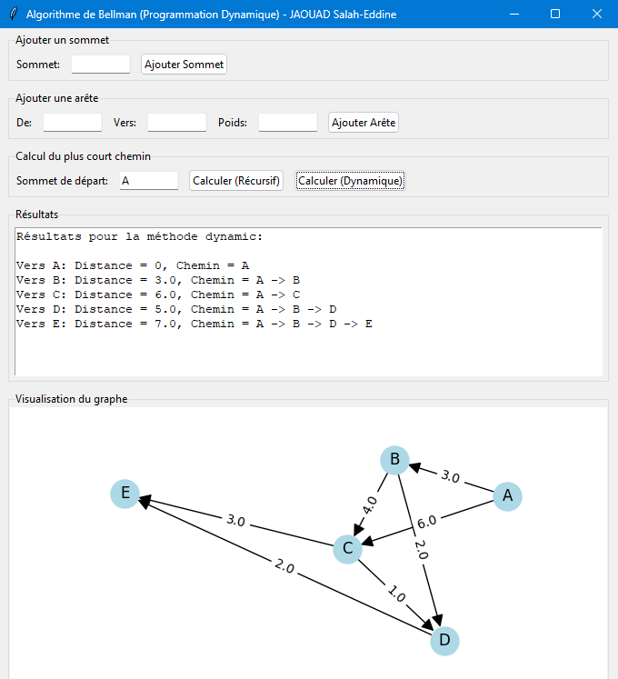

# Algorithme de Bellman - Plus Courts Chemins dans un DAG

## Description
Cette application implémente l'algorithme de Bellman pour trouver les plus courts chemins dans un graphe orienté acyclique (DAG) en utilisant la programmation dynamique. L'application propose une interface graphique permettant de construire le graphe, visualiser sa structure, et calculer les plus courts chemins selon deux approches : récursive avec mémoïsation et programmation dynamique classique.

## Prérequis
- Python 3.x
- Bibliothèques requises :
  ```bash
  pip install tkinter networkx matplotlib
  ```

## Fonctionnalités
1. **Construction du graphe**
   - Ajout de sommets dans un ordre topologique
   - Ajout d'arêtes respectant l'ordre topologique
   - Visualisation en temps réel du graphe

2. **Calcul des plus courts chemins**
   - Méthode récursive avec mémoïsation
   - Méthode de programmation dynamique classique
   - Affichage des distances et des chemins

3. **Interface utilisateur**
   - Visualisation interactive du graphe
   - Affichage des résultats détaillés
   - Gestion des erreurs et validations

## Structure du graphe
- Le graphe doit être un DAG (Directed Acyclic Graph)
- Les sommets doivent être ajoutés dans un ordre topologique
- Les arêtes ne peuvent être ajoutées que de gauche à droite dans l'ordre topologique

## Utilisation

### 1. Ajout des sommets
```
- Entrez le nom du sommet dans le champ "Sommet"
- Cliquez sur "Ajouter Sommet"
- Répétez pour chaque sommet dans l'ordre topologique souhaité
```

### 2. Ajout des arêtes
```
- Sélectionnez le sommet source dans "De"
- Sélectionnez le sommet destination dans "Vers"
- Entrez le poids de l'arête
- Cliquez sur "Ajouter Arête"
```

### 3. Calcul des chemins
```
- Entrez le sommet de départ
- Choisissez la méthode de calcul (Récursif ou Dynamique)
- Visualisez les résultats dans la zone de texte
```

## Exemple d'utilisation

### Création d'un graphe simple
1. Ajout des sommets dans l'ordre :
   ```
   A -> B -> C -> D -> E
   ```

2. Ajout des arêtes :
   ```
   A -> B : 3
   A -> C : 6
   B -> C : 4
   B -> D : 2
   C -> D : 1
   C -> E : 3
   D -> E : 2
   ```

3. Résultats attendus depuis A :
   ```
   Vers A : Distance = 0,    Chemin = A
   Vers B : Distance = 3,    Chemin = A -> B
   Vers C : Distance = 6,    Chemin = A -> C
   Vers D : Distance = 5,    Chemin = A -> B -> D
   Vers E : Distance = 7,    Chemin = A -> B -> D -> E
   ```

## Contraintes importantes
1. **Ordre topologique**
   - Les sommets doivent être ajoutés dans un ordre qui respecte les dépendances
   - Une arête ne peut pas pointer vers un sommet précédent dans l'ordre

2. **Structure DAG**
   - Pas de cycles autorisés
   - Les arêtes doivent toujours aller de gauche à droite dans l'ordre topologique

3. **Poids des arêtes**
   - Les poids peuvent être positifs ou négatifs
   - Pas de restriction sur les valeurs des poids

## Différence avec Bellman-Ford
L'algorithme de Bellman implémenté ici est différent de Bellman-Ford :
- Bellman : travaille sur des DAG, ordre topologique requis, plus rapide (O(V+E))
- Bellman-Ford : accepte les cycles, plus lent (O(VE)), détecte les cycles négatifs

## Dépannage
1. "Sommet invalide" : Vérifiez que le sommet a été ajouté dans l'ordre topologique
2. "L'arête ne respecte pas l'ordre topologique" : L'arête doit aller d'un sommet à un sommet ultérieur dans l'ordre

## Notes techniques
- Complexité temporelle : O(V + E)
- Complexité spatiale : O(V)
- V : nombre de sommets
- E : nombre d'arêtes

## Capture d'écran

